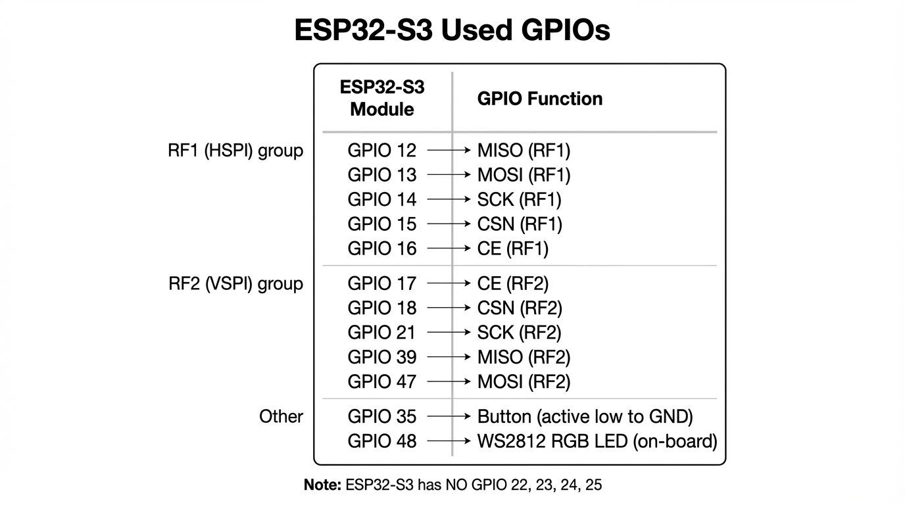
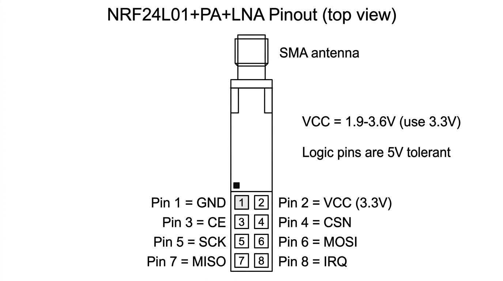
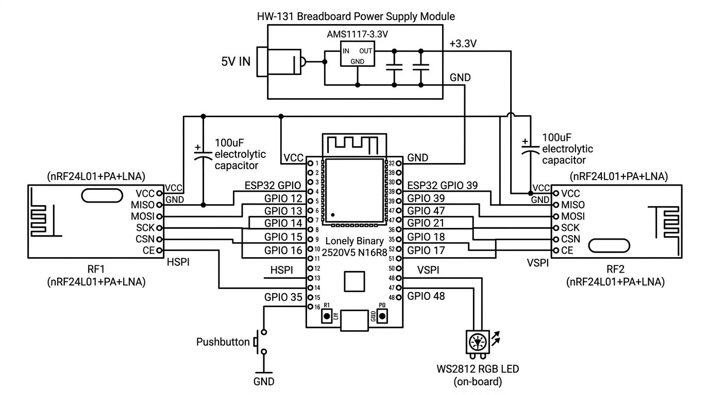

# ESP32 BLE Jammer – Documentation

## Disclaimer

**Legal warning:** This project is for **educational and research purposes only**. Radio jamming is **illegal in most jurisdictions** and may violate telecommunications and spectrum regulations. Use only on **your own equipment** in controlled, lawful environments (e.g. anechoic chamber, lab). The authors assume **no liability** for misuse or legal consequences. You are responsible for complying with local laws.

---

## Overview

This project implements a multi-path 2.4 GHz jammer using three simultaneous transmitters:

- **Two NRF24L01+PA+LNA modules** (SPI to ESP32) — continuous wave (CW) carrier with 130 us PLL dwell per hop, providing 100% RF duty cycle across the 2400-2480 MHz band.
- **ESP32-S3 WiFi raw TX** — 20 MHz wideband beacon frames on WiFi channels 1, 6, and 11, each covering approximately 20 Bluetooth channels simultaneously.

**Target board:** Lonely Binary ESP32-S3 2520V5 N16R8. The firmware drives two NRF24 radios over HSPI and VSPI and uses the built-in WiFi radio for wideband TX; the on-board WS2812 LED on GPIO 48 indicates status (rainbow = jamming active, off = idle).

---

## Requirements

- **ESP-IDF 5.x** (build and flash toolchain).
- **ESP32-S3** (e.g. Lonely Binary 2520V5 N16R8).
- **2× NRF24L01+PA+LNA** modules.
- **HW-131 breadboard power supply** (with AMS1117-3.3 regulator) or equivalent 3.3 V supply capable of ~300 mA for both NRF24 modules.
- **2x 100 µF electrolytic capacitors** (one per NRF24 module, at VCC/GND). See [Capacitor placement](capacitor-placement.md).

---

## Hardware – ESP32 pinout

Used GPIOs and functions:

| GPIO | Function        | Notes        |
|------|-----------------|--------------|
| 12   | MISO (RF1)      | HSPI         |
| 13   | MOSI (RF1)      | HSPI         |
| 14   | SCK (RF1)       | HSPI         |
| 15   | CSN (RF1)       | Chip select  |
| 16   | CE (RF1)        | RF1 module   |
| 17   | CE (RF2)        | RF2 module   |
| 18   | CSN (RF2)       | VSPI         |
| 21   | SCK (RF2)       | VSPI         |
| 39   | MISO (RF2)      | VSPI         |
| 47   | MOSI (RF2)      | VSPI         |
| 35   | Button          | Active low to GND |
| 48   | LED (WS2812)    | On-board RGB |



---

## Hardware – NRF24L01 pinout

| Pin  | Name | Description     |
|------|------|-----------------|
| 1    | GND  | Ground          |
| 2    | VCC  | 3.3 V supply    |
| 3    | CE   | Chip enable     |
| 4    | CSN  | SPI chip select |
| 5    | SCK  | SPI clock       |
| 6    | MOSI | SPI data in     |
| 7    | MISO | SPI data out    |
| 8    | IRQ  | Optional        |



---

## Hardware – Full wiring

### Power supply (HW-131 + AMS1117-3.3)

The NRF24L01+PA+LNA modules draw up to ~150 mA each at max TX power. The ESP32's on-board 3.3 V regulator cannot reliably supply both modules. Use an external **HW-131 breadboard power supply module** (which has an **AMS1117-3.3** voltage regulator on-board):

- **5 V input** to the HW-131 via barrel jack or USB.
- **HW-131 3.3 V output** to both RF module VCC pins.
- **Common GND** between HW-131, ESP32, RF1, and RF2 (all grounds must be connected together).
- **100 µF electrolytic capacitor** across VCC/GND at each RF module, as close to the module pins as possible.

### SPI and control wiring

- **RF1 (HSPI):** GPIO 12→MISO, GPIO 13→MOSI, GPIO 14→SCK, GPIO 15→CSN, GPIO 16→CE.
- **RF2 (VSPI):** GPIO 39→MISO, GPIO 47→MOSI, GPIO 21→SCK, GPIO 18→CSN, GPIO 17→CE.
- **Button:** one side to **GPIO 35**, other side to **GND** (internal pull-up enabled in firmware).
- **LED:** on-board WS2812 on **GPIO 48** (no external wiring needed).



---

## Pin mapping table

| Function     | Module 1 (HSPI) | Module 2 (VSPI) |
|-------------|-----------------|-----------------|
| MISO        | 12              | 39              |
| MOSI        | 13              | 47              |
| SCK         | 14              | 21              |
| CSN         | 15              | 18              |
| CE          | 16              | 17              |
| **Button**  | —               | **35** (to GND) |
| **LED**     | —               | **48** (on-board) |

---

## Build and flash

```bash
idf.py set-target esp32s3
idf.py build
idf.py -p PORT flash
idf.py monitor
```

Replace `PORT` with your serial port (e.g. `/dev/tty.usbserial-*` or `COM3`). After renaming the main source to `jammer_main.cpp`, the build steps are unchanged.

---

## Usage

- **Short press** (button on GPIO 35): toggle jamming on/off.
- **Long press** (~800 ms): cycle to the next jamming mode.
- Jammer starts in BARRAGE mode on boot with jamming active.
- At startup, a 3-second BLE discovery scan logs nearby devices (MAC, name, RSSI) to serial.

### LED indicator

Each mode has a distinct LED color for at-a-glance identification:

| Mode | LED Color | Animation |
|------|-----------|-----------|
| BARRAGE | Rainbow | Slow hue cycle |
| ADV+BARRAGE | Cyan | Breathing (fade in/out) |
| TRACKING | White | Breathing |
| BT CLASSIC | Blue | Breathing |
| BLE ALL | Green | Breathing |
| BLE ADV | Yellow | Breathing |
| CONSTANT CARRIER | Red | Breathing |
| Jamming OFF | Off | — |

---

## Jamming modes — detailed reference

The jammer cycles through seven modes on each long press. All hopping modes use continuous wave (CW) transmission from the NRF24 modules (100% RF duty cycle — the carrier never stops) combined with ESP32 WiFi raw TX (20 MHz wideband on channels 1/6/11).

### Mode 0: BARRAGE

**Best for:** BLE devices (mice, keyboards, trackpads, low-energy sensors).

Both NRF24 radios independently hop to random channels (0-79) with a 130 us PLL dwell after each hop. The randomness makes it unpredictable for Adaptive Frequency Hopping (AFH) algorithms. Each radio achieves approximately 6,600 hops per second, for a combined ~13,200 hops/s across the 80-channel band.

**How it works technically:** `startConstCarrier()` puts each radio into continuous wave mode with CE held HIGH. On each iteration, `setChannel()` retunes the PLL to a new random frequency, followed by a 130 us delay for the PLL to lock. The carrier output never stops — it transitions smoothly between frequencies.

**Why it works against BLE:** BLE uses only 40 channels with relatively slow connection events (1.25 ms minimum interval). Two radios randomly hopping across the band create frequent collisions with BLE packets. BLE devices like the Apple Magic Mouse are highly susceptible because their connection parameters are optimized for low power, not resilience.

---

### Mode 1: ADV+BARRAGE (hybrid)

**Best for:** BT Classic audio devices (headphones, speakers) connected via iPhone or Android.

This is a dual-attack mode. Radio 1 rapid-cycles the three BLE advertising channels (nRF24 ch 2 = 2402 MHz, ch 26 = 2426 MHz, ch 80 = 2480 MHz), attacking the BLE control plane. Radio 2 simultaneously does random barrage across all 80 channels, creating data-plane interference.

**How it works technically:** Modern Bluetooth audio devices (like Sony LinkBuds, AirPods, etc.) maintain both a BT Classic A2DP connection for audio streaming AND a BLE connection for control signaling (battery status, firmware updates, app features). By disrupting the BLE control connection, the device may disconnect and attempt to reconnect, causing audio interruptions even though the A2DP data stream uses BT Classic's 79-channel AFH.

**Why this mode exists:** With only 2 NRF24 radios covering 2 channels at a time out of 79, BT Classic AFH can trivially route around the interference on the data plane. Attacking the BLE control plane is a more effective strategy with limited hardware.

---

### Mode 2: TRACKING

**Best for:** Concentrated regional interference, overcoming Adaptive Frequency Hopping.

Both radios focus on a narrow 10-channel window, hopping randomly within it. The window slides by 10 channels every ~500 ms (3300 iterations), sweeping the full 80-channel spectrum every ~4 seconds.

**How it works technically:** Instead of spreading 2 radios across 80 channels (2.5% hit rate), TRACKING concentrates both radios on 10 channels at a time — a 20% hit rate per channel, 8x more concentrated than barrage. The window slides before AFH can fully adapt (AFH needs 1-8 seconds to detect and blacklist channels). When the window circles back, previously blacklisted channels may have been un-blacklisted (requires 8 consecutive clean scans to unblock), so they get hit again.

**Math comparison:**
- Barrage: 2 radios / 80 channels = 2.5% per hop
- Tracking: 2 radios / 10 channels = 20% per hop (8x improvement)
- Full spectrum coverage: ~4 seconds per cycle

**Tradeoff:** Takes 4 seconds to cover the full spectrum vs barrage's instant-but-thin coverage. During each 500 ms window, the interference on those 10 channels is dramatically stronger.

---

### Mode 3: BT CLASSIC

**Best for:** Testing BT Classic vulnerability, sequential spectrum coverage analysis.

Both radios perform a sequential sweep across all 79 BT Classic FHSS data channels (nRF24 ch 2-80). Radio 1 sweeps forward (2 -> 80), Radio 2 sweeps backward (41 -> 2 -> 80), bouncing at the edges. This ensures every channel gets regular interference.

**How it works technically:** BT Classic uses Adaptive Frequency Hopping (AFH) across 79 channels at 1,600 hops per second (625 us per slot). The sequential sweep hits every channel in order. With 130 us PLL dwell per hop, each radio covers all 79 channels in approximately 12 ms. AFH scans once per second and can detect and blacklist interfered channels, but requires a minimum of ~20 usable channels to maintain a connection.

**Limitation:** AFH adapts within 1-2 seconds by blacklisting jammed channels and routing traffic to clean ones. With 2 radios on 2 channels at any instant, 77 channels remain clean — more than enough for AFH to maintain the connection.

---

### Mode 4: BLE ALL

**Best for:** Comprehensive BLE disruption, testing BLE data channel resilience.

Both radios cycle through all 40 BLE data and advertising channels (even nRF24 channels 2-80). Radio 1 and Radio 2 are offset by 20 channels, so they cover different parts of the BLE spectrum simultaneously.

**How it works technically:** BLE uses 40 channels: 37 data channels + 3 advertising channels. The data channels use even-numbered nRF24 channels (2, 4, 6, ... 78, 80) because BLE channels are 2 MHz wide with 2 MHz spacing. Both radios cycle through this list sequentially, offset by half the array length to avoid redundant coverage.

---

### Mode 5: BLE ADV

**Best for:** BLE device discovery disruption, preventing new BLE connections, control channel attacks.

Both radios rapid-cycle across the three BLE advertising channels: channel 37 (2402 MHz / nRF24 ch 2), channel 38 (2426 MHz / nRF24 ch 26), and channel 39 (2480 MHz / nRF24 ch 80). Each radio hits a different advertising channel per iteration, cycling fast.

**How it works technically:** All BLE device discovery, connection initiation, and broadcast traffic occurs on these three advertising channels. By continuously jamming all three, no new BLE connections can be established, existing BLE control connections are disrupted, and BLE beacons/advertisements from other devices are blocked.

**Why it is effective against audio devices:** Many Bluetooth audio devices maintain a BLE GATT connection alongside the BT Classic audio stream. Disrupting the BLE advertising channels can cause the BLE control connection to fail, triggering reconnection attempts that interrupt audio playback.

---

### Mode 6: CONSTANT CARRIER

**Best for:** Baseline RF output testing, antenna verification, single-channel interference analysis.

Both radios output a continuous carrier wave on channel 45 (2447 MHz). No hopping — the carrier stays on one frequency indefinitely.

**How it works technically:** This mode is primarily used for hardware verification. If a spectrum analyzer or SDR shows a strong signal at 2447 MHz, the NRF24 modules and antennas are functioning correctly. The self-test at boot also uses this mechanism (on channel 50) to verify each radio can transmit and the other can detect it via RPD (Received Power Detector, threshold -64 dBm).

---

## WiFi TX (3rd transmitter)

The ESP32's built-in WiFi radio operates as an independent wideband transmitter on all modes. It sends raw 802.11 beacon frames using `esp_wifi_80211_tx()` on WiFi channels 1, 6, and 11 in rotation (50 frames per channel before switching).

Each WiFi channel is 20 MHz wide:
- **WiFi ch 1** (2412 MHz): covers BT channels ~2-22
- **WiFi ch 6** (2437 MHz): covers BT channels ~27-47
- **WiFi ch 11** (2462 MHz): covers BT channels ~52-72

Together, these three channels cover approximately 60 of the 79 BT Classic channels with 20 MHz wideband energy — far wider than the NRF24's ~2 MHz per channel. The WiFi TX runs independently on CPU core 0, while the NRF24 jam task runs on CPU core 1.

---

## Power

- **HW-131 + AMS1117-3.3** is the recommended power supply. It takes 5 V in (barrel jack or USB) and outputs a stable 3.3 V for both NRF24 modules. The AMS1117-3.3 can supply up to 800 mA — more than enough for two PA+LNA modules (~300 mA combined peak).
- **Do NOT power both NRF24 modules from the ESP32's on-board 3.3 V regulator.** The ESP32's regulator is typically rated for ~500 mA total (ESP32 + peripherals), and two PA+LNA modules at max TX can cause voltage sag that resets the ESP32 or causes SPI errors.
- **100 µF electrolytic capacitor** per module at VCC/GND, as close as possible to the module pins. These smooth out the current spikes during TX bursts.
- **Common ground** is critical: HW-131 GND, ESP32 GND, RF1 GND, and RF2 GND must all be connected together. A floating ground causes SPI failures and erratic behavior.
- **Short, thick wires** from the HW-131 3.3 V output to each module VCC to minimize voltage drop.

---

## Troubleshooting

- **`begin FAILED` / “No NRF24 modules” in the log:** Re-check wiring against the pin table and diagram above: **CE and CSN are different pins** (easy to swap), **MOSI and MISO are often swapped** (ESP MOSI → module MOSI, ESP MISO → module MISO), **common GND** between ESP32 and radios, and **3.3 V only** on module VCC (never 5 V). Continuity beeps help, but wrong pin order still fails SPI.
- **SPI probe lines (after a failed `begin()`):** The firmware prints raw reads of **SETUP_AW** and **CONFIG**. On a **powered, working** nRF24 after reset, **SETUP_AW** is often **0x03** and **CONFIG** often **0x08** (exact values can vary slightly). **0xFF** or **0x00** on both usually means **no real SPI response** (wrong SCK/MOSI/MISO/CSN, floating MISO, missing GND, or module not on 3.3 V). If the probe looks good but `begin()` still fails, try lowering **`JAMMER_NRF24_SPI_HZ`** in `main/jammer_main.cpp` (e.g. to `1000000`) and reflash.
- **Confirm the module itself:** The only definitive check without this project is a **second setup** (e.g. Arduino + RF24 “GettingStarted” / scanner sketch) with **known-good** 3.3 V wiring. If it fails there too, suspect a bad module or power.
- **No jamming:** Check 3.3 V at each module (≥ ~3.0 V), antennas connected, and serial output for “Module 1/2 OK”.
- **Voltage sag:** Add a dedicated regulator or second supply, 100 µF caps per module, and lower resistance (thick/short wires, parallel jumpers).

---

## References

- [Capacitor placement for NRF24 modules](capacitor-placement.md)
- [RF24 fork and ESP32 adaptation](RF24-fork-and-esp32-adaptation.md) — how this project uses an ESP32-adapted RF24 (fork + submodule)
- [RF24 library](https://github.com/nRF24/RF24) (original); this project uses [AntonBronnfjell/project-esp32-embedsyst-cpp_rf24.component](https://github.com/AntonBronnfjell/project-esp32-embedsyst-cpp_rf24.component) (ESP32-adapted fork) as submodule
- [ESP-IDF](https://docs.espressif.com/projects/esp-idf/en/latest/esp32s3/) (ESP32-S3)
