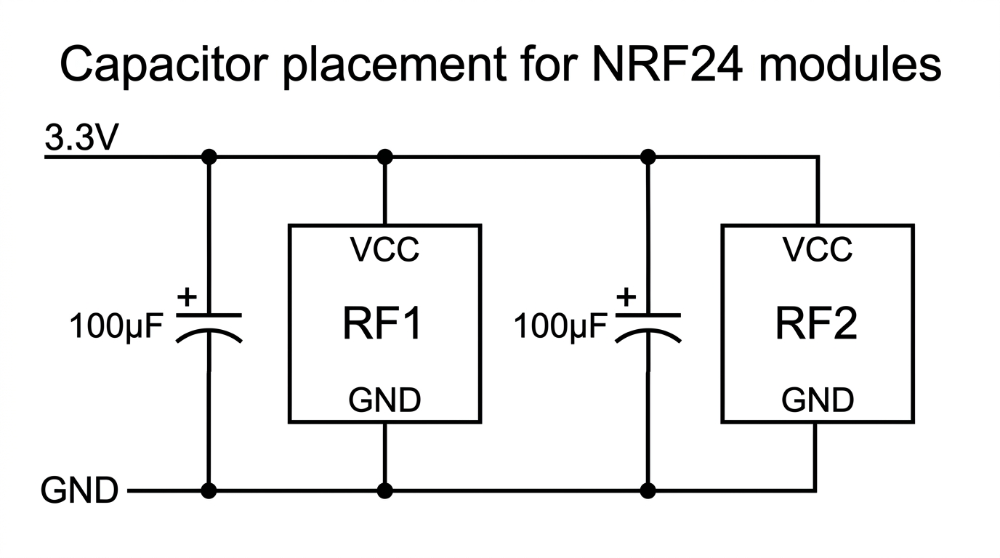

# 100 µF Capacitor Placement for NRF24 Modules

Part of the [ESP32 BLE Jammer](README.md) hardware setup. This page describes how to add decoupling capacitors to reduce voltage sag when both NRF24L01+PA+LNA modules transmit.

---

## Why add capacitors?

When both radios transmit, current draw on the 3.3 V supply can cause **voltage sag** (e.g. down to ~2.7 V). That can make the modules unreliable or fail to initialize. Placing a **100 µF electrolytic capacitor** as close as possible to each module’s VCC and GND helps stabilize the voltage during transmit peaks.

---

## Goal

- Use **one 100 µF capacitor per module**.
- Place each capacitor **as close as possible** to that module’s VCC and GND pins (short leads).
- Connect the capacitors in **parallel** with the existing 3.3 V supply to the modules; do not remove or replace the existing power wiring.

---

## Polarity (electrolytic)

| Lead   | Symbol | Connect to  |
|--------|--------|-------------|
| **+**  | Long leg / positive | **3.3 V** (VCC) |
| **−**  | Short leg / negative | **GND** |

Wrong polarity can damage the capacitor or cause failure. Double-check before powering on.

---

## Schematic

Each capacitor sits between 3.3 V and GND, physically close to its module. The 3.3 V rail (from regulator or ESP32) feeds both modules; each module has its own 100 µF cap right at its VCC/GND.

---

## Pin mapping

| Component   | Connection |
|------------|------------|
| **Cap 1**  | (+) → RF1 VCC, (−) → RF1 GND (at the RF1 module) |
| **Cap 2**  | (+) → RF2 VCC, (−) → RF2 GND (at the RF2 module) |

The same 3.3 V and GND that already feed the modules also feed the caps; the caps are in parallel with each module.

---

## In practice

1. **RF1:** Place one 100 µF capacitor right at the RF1 module: positive lead to RF1’s **VCC**, negative lead to RF1’s **GND**. Use short wires or solder to the module’s pins / breadboard row.
2. **RF2:** Place the second 100 µF capacitor right at the RF2 module: positive to RF2’s **VCC**, negative to RF2’s **GND**.
3. Keep your existing 3.3 V and GND runs to both modules; the capacitors add filtering at the load, they do not replace the supply wires.

If voltage still sags under load, see the main doc [Power](README.md#power) and [Troubleshooting](README.md#troubleshooting) (e.g. dedicated 3.3 V regulator, lower resistance wiring, or a second supply).

---

## Full system wiring

The 100 µF capacitors attach at each NRF24 module’s VCC and GND in the overall system. Below is the full wiring diagram; add one cap across VCC/GND at RF1 and one at RF2 as described above.

---

## References

- [Main documentation](README.md) — overview, wiring, power, and troubleshooting
- [Power section](README.md#power) — 3.3 V regulator and low-resistance supply
